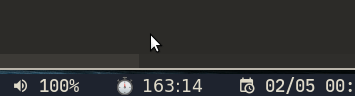

# i3blockstimerthing

Hello. I hacked up this script for i3blocks (or i3xrocks if you use [Regolith](https://regolith-linux.org) like me). What it does is count time up so I know when I was sitting too much and should go stretch and have a glass of water.

Clicking on it resets the timer.  

The Pomodoro Technique is also nice.

## How? Why?

I believe you have some kind of Python 3.
Clone/download this script, make sure it's executable, and then in your i3blocks or i3xrocks config do something like this:

	[timerthing]
	command=/home/amir/dev/i3blockstimerthing/i3blockstimerthing.py
	interval=1

I put it just after my `[time]` block so I can be happier in my life.

Now restart something and you should see it.

The script saves a file with the unix timestamp of the time to calculate since when it started. At the time of writing it's in `/tmp/` somewhere.

## TODO

 - [ ] Configurable filename for keeping timer start, allowing to keep the timer running even after restatrts
 - [ ] Be red and sad when >25m, should also be configurable for on/off and the time passed for when to shout at you
 - [ ] Better python-foo
 - [ ] Customizable formatting of the text
 - [ ] Does anyone want this to run for days? hours? if so, support h:mm:ss formats :) and not only m:ss
 - [ ] I think that's it, I'm very proud of myself.
